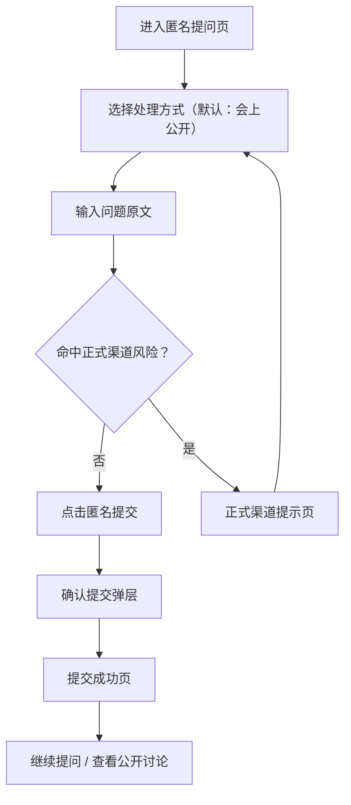
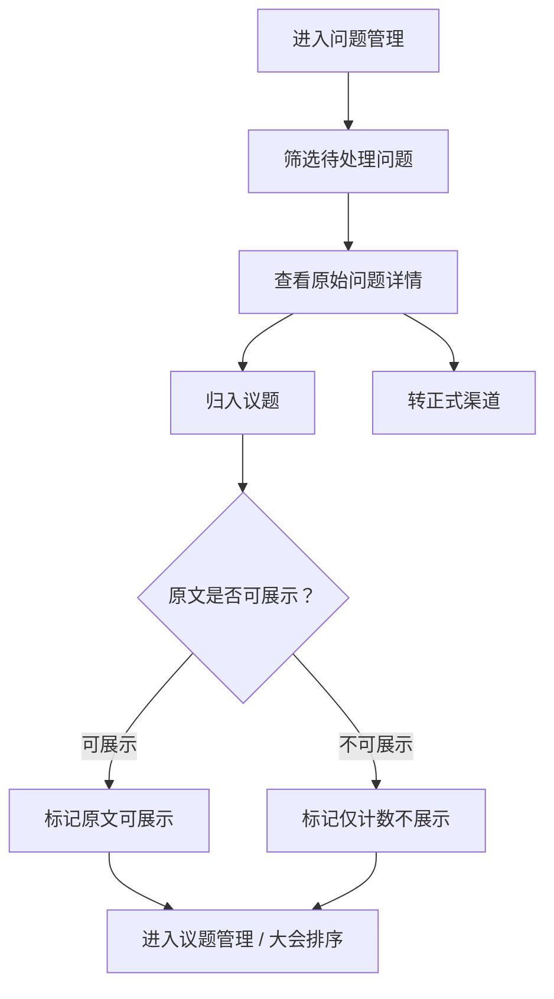

# Interaction Design

本文档在 PRD、页面文案和线框基础上，补充页面流转、关键组件、反馈机制和异常场景，作为 V1 交互设计与前端实现的共同依据。

## 1. Design Goals

- 在员工端优先建立 `可信、克制、低暴露感` 的体验。
- 在会务端优先保证 `原文不可改`、`归类高效`、`现场可控`。

## 2. Experience Principles

### 2.1 先建立信任，再让用户输入

- 员工端首屏先回答三个问题：`会前是否公开`、`原文会不会被改写`、`是否收集身份信息`。
- 风险提示不放进帮助中心，而是固定放在输入区附近和提交按钮上方。

### 2.2 默认选最稳妥的路径

- 默认路由始终为 `会上公开`。
- `公开讨论` 明确标注“审核后公开”，避免误触。

### 2.3 风险提示以“提醒”为主，不制造拦截感

- 对可识别信息先做轻提醒，不默认恐吓式警告。
- 仅在命中正式渠道关键词时触发强拦截提示页或弹窗。

### 2.4 任何管理动作都不能长得像“编辑原文”

- 会务端只能做 `归类`、`状态变更`、`排序`。
- 原文展示区域使用只读样式，与输入框视觉彻底区分。

## 3. Information Architecture

```text
员工端 H5
├─ 匿名提问页
├─ 提交确认底部弹层
├─ 提交成功页
├─ 正式渠道提示页
└─ 公开讨论池

会务端 Web
├─ 问题管理
├─ 议题管理
├─ 大会答疑控制台
└─ 投屏展示页
```

## 4. Primary Flows

### 4.1 员工提问主流程



### 4.2 会务处理主流程



## 5. Employee H5

### 5.1 匿名提问页布局

推荐采用 `顶部信任区 + 路由选择区 + 输入区 + 固定底部行动区` 的单列布局。

页面结构：

1. 顶部信任区
2. 处理方式卡片组
3. 问题输入区
4. 风险提示区
5. 次级入口：`查看公开讨论`
6. 吸底主按钮：`匿名提交`

布局意图：

- 顶部信任区只放最关键的 2-3 条承诺，降低黑箱感。
- 路由卡片先于输入框，帮助用户先理解后果再输入。
- 主按钮吸底，保证单手操作和持续可见。

### 5.2 顶部信任区

建议以轻量信息条或卡片形式呈现三条核心承诺：

- `会前默认不公开`
- `原始问题不会被改写`
- `系统默认不收集姓名、工号等身份信息`

交互要求：

- 不可折叠到完全消失。
- 首屏内必须可见至少两条承诺。
- 点击“了解更多”时，可展开补充说明，但不跳离当前页。

### 5.3 处理方式卡片

两张卡片均为整卡可点，结构统一：

1. 标题
2. 一行结果描述
3. 一枚辅助标签

卡片标签建议：

- `公开讨论`：`审核后公开`
- `会上公开`：`默认推荐`

选中反馈：

- 边框高亮
- 背景轻微变化
- 标题和标签同步强化

切换规则：

- 默认进入页面时选中 `会上公开`。
- 切换路由不清空已输入内容。

### 5.4 输入区

输入区为单一多行文本框，不提供标题、副标题、附件、图片等复杂能力。

交互规则：

- 占位文案优先提醒“描述问题本身”，弱化格式要求。
- 实时字数计数显示为 `当前字数 / 500`。
- 小于 `10` 字时按钮禁用，同时在输入框下显示温和提示。
- 超过 `500` 字时保留输入内容，但显示超限错误，不允许提交。

状态反馈：

- `默认态`：仅显示占位文案和字数计数。
- `聚焦态`：边框强化，风险提示保持可见。
- `错误态`：错误信息贴近输入框，不用全局弹窗。

### 5.5 风险提示与正式渠道拦截

员工端风险提示分两层：

1. 常驻轻提示
2. 命中关键词后的强提醒

常驻轻提示固定展示：

- `请避免填写具体人名、项目名、时间点等可识别信息。`
- `原始问题不会被改写，但不代表所有原文都会被公开展示。`
- `如涉及举报、骚扰、歧视、舞弊、合规或个人权益事项，请走正式渠道。`

强提醒触发建议：

- 用户输入命中 `举报 / 骚扰 / 歧视 / 舞弊 / 合规 / 劳动争议 / 侵权` 等正式渠道关键词。
- 会务端仍保留最终判断权，前端只做提醒，不做绝对拦截判定。

强提醒交互：

- 以底部弹层或整页提示呈现，不直接丢失用户输入。
- 提供 `返回修改` 与 `查看正式渠道说明` 两个动作。
- 不提供“仍然提交到公开讨论”的主推荐按钮。

### 5.6 提交确认层

移动端推荐使用 `底部弹层`，比居中模态更贴近 H5 操作习惯。

确认层固定结构：

1. 标题
2. 当前处理方式说明
3. 一条不可改写承诺
4. 主次按钮

两种路由的强化点：

- `公开讨论`：强调“审核后其他同事可见”
- `会上公开`：强调“会前不公开”

按钮规则：

- 主按钮：`确认提交`
- 次按钮：`取消`
- 点击遮罩可关闭，但不丢失内容

### 5.7 提交成功页

成功页核心目标是降低“提完就消失”的不确定感，因此要同时告诉用户：

1. 已经提交成功
2. 会如何流转
3. 下一步还能做什么

页面结构：

- 成功标题
- 根据路由变化的说明正文
- 主按钮：`继续提问`
- 次按钮：`查看公开讨论`

特殊规则：

- 不提供“查看我的提交记录”，避免制造身份关联预期。

### 5.8 公开讨论池

公开讨论池是“透明处理感”的补充页面，不是社区产品。

信息层级：

1. 顶部说明：仅展示审核通过内容
2. 搜索与议题筛选
3. 问题列表
4. 去提问入口

列表卡片字段顺序建议：

1. 原文
2. 议题标签
3. 答复状态
4. 日期

交互规则：

- 不出现点赞、评论、支持、分享。
- 日期只显示到天，不显示具体时间。
- 搜索结果为空时，优先引导 `去提问`。
- 从公开讨论池返回提问页时，保留默认路由为 `会上公开`，不受上次浏览影响。

### 5.9 员工端状态矩阵

| 场景 | 页面反馈 | 是否保留输入 |
| --- | --- | --- |
| 字数不足 | 输入框下提示 + 按钮禁用 | 是 |
| 字数超限 | 输入框下报错 + 按钮禁用 | 是 |
| 提交中 | 主按钮 loading | 是 |
| 提交失败 | 页面顶部 toast + 按钮恢复 | 是 |
| 命中正式渠道风险 | 强提醒弹层或说明页 | 是 |

## 6. Organizer Web

### 6.1 问题管理页

推荐结构为 `顶部横向导航 + 筛选条 + 问题表格 + 右侧详情抽屉`。

页面优先级：

1. 先找到待处理问题
2. 再查看原文
3. 再决定归类和展示状态

关键规则：

- 页面顶部固定 banner：`原始问题不可编辑、不可改写。`
- 表格中的原始问题只展示摘要，完整原文只在详情抽屉里阅读。
- 抽屉中的原文区域必须使用只读卡片样式，不能长得像文本输入框。

推荐默认筛选：

- `display_status = pending`
- `route = 全部`
- 排序按 `最新提交优先`

### 6.2 问题详情抽屉

详情抽屉字段顺序建议：

1. 原始问题全文
2. 处理方式
3. 当前议题
4. 展示状态
5. 答复状态
6. 提交日期
7. 操作区

操作区分组：

- `归类动作`：归入现有议题 / 新建议题
- `展示动作`：标记原文可展示 / 标记仅计数不展示
- `流程动作`：转正式渠道 / 标记已答复 / 归档

确认要求：

- `转正式渠道` 需要二次确认，并要求管理员选择原因。
- `标记仅计数不展示` 建议附带简短原因标签，便于审计。
- 所有操作成功后给出 toast，并在列表中即时刷新状态。

### 6.3 议题管理页

议题管理页应从“问题视角”切到“议程视角”。

推荐结构：

- 左侧或主区域：议题列表
- 右侧抽屉：当前议题详情与同类问题列表

视觉重点：

- `同类问题数` 是主数据，应作为列表中最醒目的数字。
- `可展示原文数` 是次级数据，用于判断现场是否有足够样本可投屏。

核心动作：

- 创建议题
- 调整大会顺序
- 标记议题已答复
- 导出 FAQ

细节要求：

- 未归类问题应有明确入口，不允许被“藏”在筛选里。
- 同一条原始问题在议题详情中保持原文展示，不用摘要替代。

### 6.4 大会答疑控制台

建议拆成两个模式：

1. `主持人控制模式`
2. `投屏展示模式`

主持人控制模式包含：

- 左侧议题队列
- 中间当前题卡
- 底部快捷操作

投屏展示模式包含：

- 当前议题标题
- 同类问题数
- 1-3 条可展示原文
- 当前答复状态

交互重点：

- 切题操作必须大按钮、低误触。
- 当前题目切换后，状态按钮位置不变，减少现场学习成本。
- 若议题没有可展示原文，则自动切换到“仅展示议题标题与频次”的模板。

### 6.5 会务端状态矩阵

| 操作 | 反馈 | 备注 |
| --- | --- | --- |
| 归入议题成功 | toast + 列表即时更新 | 保持抽屉打开 |
| 标记展示状态成功 | toast + 状态 badge 更新 | 写入审计日志 |
| 转正式渠道 | 二次确认 + 成功反馈 | 默认从当前待处理列表移出 |
| 调整排序 | 即时保存或显式保存二选一 | V1 建议显式保存 |

## 7. Shared Components

### 7.1 状态标签

统一使用标签系统表达状态，避免用纯文本堆叠。

建议状态集合：

- 路由：`公开讨论 / 会上公开`
- 展示状态：`待处理 / 原文可展示 / 仅计数不展示 / 转正式渠道 / 已归档`
- 答复状态：`待回答 / 已现场回答 / 会后补答`

规则：

- 同一维度状态使用同一种视觉样式。
- 危险动作相关状态如 `转正式渠道` 使用更强对比色。

### 7.2 Toast 与空状态

Toast 只用于轻量反馈：

- 提交成功
- 状态变更成功
- 网络失败

空状态必须带下一步动作：

- 公开讨论池为空：`去提问`
- 待处理问题为空：`查看全部问题`

### 7.3 二次确认组件

下列动作建议强制二次确认：

- 员工提交问题
- 会务转正式渠道
- 会务归档问题

组件规范：

- 标题先说动作，再说后果
- 正文只解释结果，不重复通用帮助文案
- 主次按钮文案必须具体，不使用模糊的“确定”

## 8. Responsive And Accessibility

### 8.1 Responsive

- 员工端以 `375px` 为基准，按钮吸底，输入区避免被键盘完全遮挡。
- 会务端最低适配 `1280px`，表格列过多时优先横向裁剪摘要，不压缩操作区。
- 投屏展示页优先适配 `16:9`，所有关键文本在远距离可识别。

### 8.2 Accessibility

- 所有状态变化不能只靠颜色表达，需配合标签文字或图标。
- 会务端表格与抽屉操作需支持键盘焦点移动。
- 按钮、卡片、筛选项点击区域保持充足热区。
- 风险提示与错误提示应贴近触发区域，避免只放全局通知。

## 9. Suggested Next Deliverables

基于当前交互方案，后续建议按以下顺序继续推进：

1. 先出员工端 H5 中保真页面
2. 再出会务端关键后台页
3. 最后补投屏态与现场控制页

这样可以优先验证最关键的匿名信任感与提交流程。
